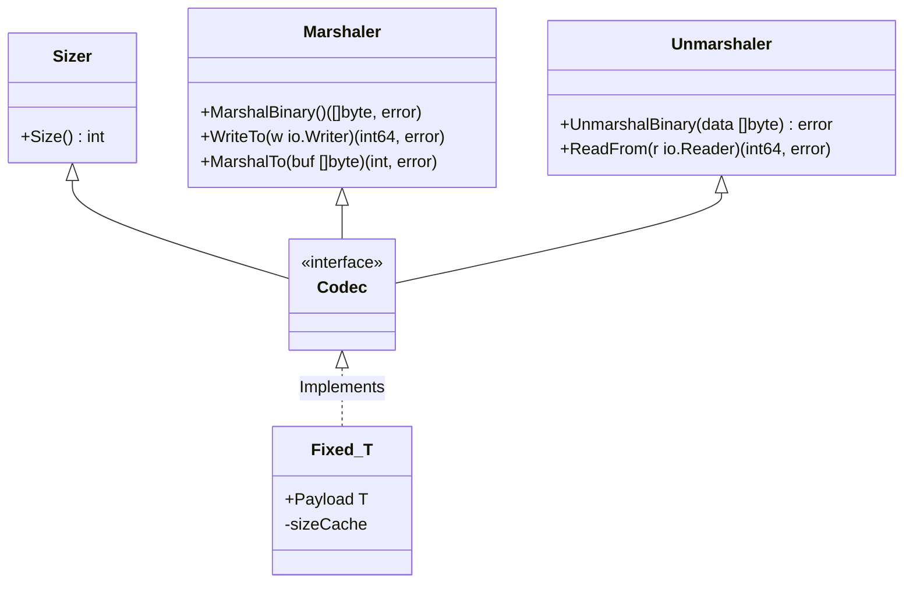

# Codec: High-Performance Binary Serialization

[](https://goreportcard.com/report/github.com/oy3o/codec)
[](https://opensource.org/licenses/MIT)

[中文](./README.zh.md) | [English](./README.md)

`codec` is a **binary serialization library** designed for high-performance network protocols and file format parsing in Go.

It addresses the performance bottlenecks (heavy reflection) and verbosity associated with the standard library's `encoding/binary`. By leveraging **Generics** and **Buffer Pooling**, `codec` provides **Zero-Allocation** read/write capabilities and a robust **Streaming** interface.

It is specifically tailored for building TCP protocol stacks, file parsers, or any scenario requiring ultra-low latency binary data processing.

## Core Features

*   **High-Performance Fixed-Size Encoding**:
    *   Uses `Fixed[T]` generics to automatically cache struct sizes, avoiding repetitive reflection overhead (`binary.Size`).
    *   Eliminates the boilerplate code of manual `binary.Write` calls.
*   **Enhanced Stream I/O**:
    *   **Error Latching**: The `Reader` and `Writer` capture the first error encountered, allowing for fluent, chained calls without checking `if err != nil` at every step.
    *   **Smart Buffering**: Intelligently wraps `bufio` to prevent performance degradation caused by **Double Buffering**.
*   **Zero-Copy Optimization**:
    *   Provides `BytesReader` and `BytesWriter` to operate directly on memory slices.
    *   Fully implements `io.ReaderFrom` and `io.WriterTo` to utilize underlying optimizations (like `sendfile` or memory copy).
*   **Complex Structure Support**:
    *   **List[T]**: Native support for encoding/decoding slices of structs with built-in **Memory Alignment** (e.g., 4-byte/8-byte padding).
    *   **ChainedReader**: A specialized reader for handling streams with Trailers (data following a main payload).
*   **Safety & Robustness**:
    *   **CheckTrailingNotZeros**: Validates that no garbage data remains after parsing.
    *   **MaxPadding**: Protects against malicious excessive padding attacks.

## Installation

```bash
go get github.com/oy3o/codec
```

## Quick Start

### 1. Fixed-Size Structs

For structs with fixed-length fields, `Fixed[T]` delivers maximum performance with minimal code.

```go
package main

import (
    "fmt"
    "github.com/oy3o/codec"
)

// Define your protocol header. Must contain fixed-size fields only.
type Header struct {
    Magic   uint32
    Version uint16
    OpCode  uint16
    BodyLen uint64
}

func main() {
    // 1. Create the codec wrapper
    h := codec.Fixed[Header]{
        Payload: Header{
            Magic:   0xCAFEBABE,
            Version: 1,
            OpCode:  101,
            BodyLen: 500,
        },
    }

    // 2. Marshal (Serialize)
    // The first call calculates and caches the size; subsequent calls have zero reflection overhead.
    data, _ := h.MarshalBinary()
    fmt.Printf("Size: %d bytes, Hex: %x\n", h.Size(), data)

    // 3. Unmarshal (Deserialize)
    var h2 codec.Fixed[Header]
    _ = h2.UnmarshalBinary(data)
    fmt.Printf("Decoded: %+v\n", h2.Payload)
}
```

### 2. Streaming & Lists with Alignment

Handle complex network streams with automatic padding alignment.

```go
func handleConnection(conn net.Conn) {
    // 1. Create a buffered Writer
    w, _ := codec.NewWriter(conn)
    
    // 2. Fluent Writing (Error Latching)
    // You don't need to check errors after every line.
    w.WriteUint32(0xDEADBEEF) // Magic
    w.WriteUint8(1)           // Version
    
    // 3. Write a List (Align to 4 bytes)
    items := []codec.Codec{
        &codec.Fixed[Item]{Payload: Item{ID: 1}},
        &codec.Fixed[Item]{Payload: Item{ID: 2}},
    }
    list := codec.NewList4(items) // Auto-handles padding between items
    w.WriteFrom(list)

    // 4. Commit and Check Error
    // Flush the buffer and check the first error that occurred (if any).
    if _, err := w.Result(); err != nil {
        log.Println("Write failed:", err)
        return
    }
}
```

### 3. Advanced Stream Processing (ChainedReader)

Handle protocols designed as "Payload + Trailer".

```go
func readStream(r io.Reader) {
    // Assume the first 100 bytes are the main payload
    payloadSize := 100
    
    // Define behavior after payload is consumed (e.g., verify signature or read trailer)
    onPayloadDone := func(trailerReader io.Reader) error {
        // Read the remaining trailer data
        trailerData, _ := io.ReadAll(trailerReader)
        fmt.Println("Trailer read:", len(trailerData))
        return nil
    }

    // Create a ChainedReader
    cr := codec.ChainReader(r, int64(payloadSize), onPayloadDone)

    // Read the main body
    body := make([]byte, payloadSize)
    io.ReadFull(cr, body) 
    
    // When the body is fully read, `onPayloadDone` triggers automatically.
}
```

## Architecture

`codec` balances flexibility and performance using a set of granular interfaces.



## Components

### `Fixed[Payload]`
The core of the library. It uses Go generics to wrap fixed-size structs (structs without slice, map, or string fields).
- **Size Cache**: Uses `xsync.Map` to safely cache type sizes concurrently, making `Size()` calls extremely fast.
- **Generic Implementation**: Automatically implements the `Codec` interface for any compliant struct.

### `Writer` / `Reader`
Advanced wrappers around standard `io` interfaces.
- **Typed Operations**: Methods like `WriteUint32`, `ReadInt64`, `WriteBool` with configurable ByteOrder (BigEndian/LittleEndian).
- **Error Latching**: Maintains an internal `err` state. If an error occurs (e.g., `io.ErrShortWrite`), subsequent operations become no-ops until `Result()` or `Flush()` is called.

### `List[T]`
Handles slices of `Codec` items.
- **Alignment**: Factory methods like `NewList4` and `NewList8` automatically insert `Zero Padding` bytes between elements to satisfy protocol alignment requirements.

### `CheckTrailingNotZeros`
A security utility. Automatically called at the end of `UnmarshalBinary`. It checks if any non-zero bytes remain in the reader, which is critical for detecting packet truncation, parsing bugs, or protocol smuggling attacks.

## Interfaces

To integrate custom types into the `codec` ecosystem, simply implement the `Codec` interface:

```go
type Codec interface {
    Sizer
    Marshaler
    Unmarshaler
}

type Sizer interface {
    Size() int
}

type Marshaler interface {
    encoding.BinaryMarshaler
    io.WriterTo
    MarshalTo(buf []byte) (int, error) // Zero-allocation write
}

type Unmarshaler interface {
    encoding.BinaryUnmarshaler
    io.ReaderFrom
}
```
