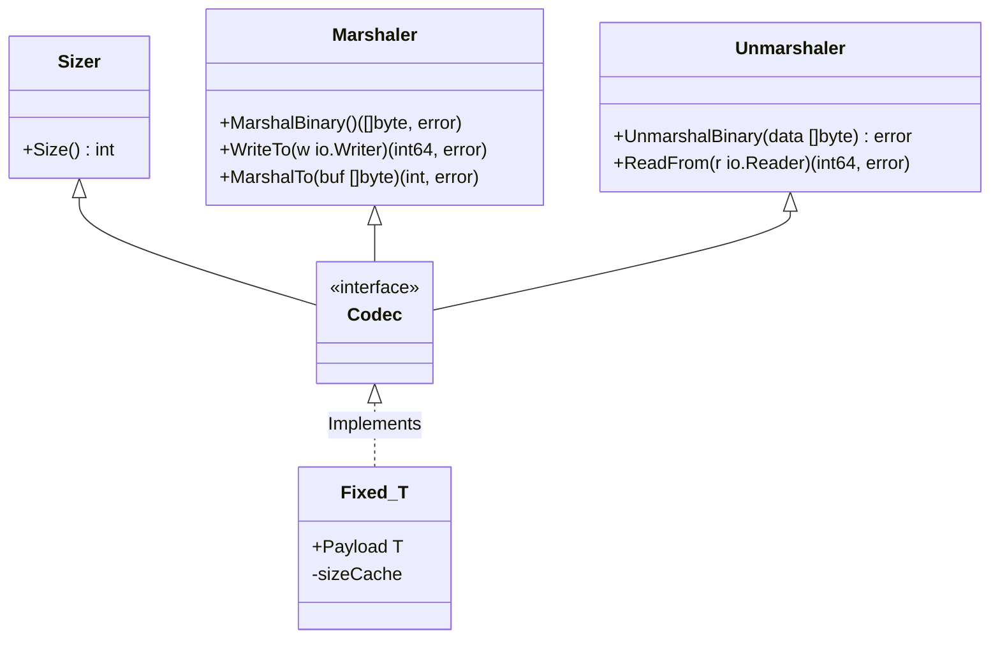

# Codec: High-Performance Binary Serialization

[](https://goreportcard.com/report/github.com/oy3o/codec)
[](https://opensource.org/licenses/MIT)

[中文](./README.zh.md) | [English](./README.md)

`codec` 是一个专为高性能网络协议和文件格式解析设计的 **Go 二进制序列化库**。

它旨在解决标准库 `encoding/binary` 在处理复杂结构时反射开销大、API 繁琐的问题。通过泛型 (`Generics`) 和 缓冲池技术，`codec` 提供了**零分配 (Zero-Allocation)** 的读写能力和**流式 (Streaming)** 处理接口。

它特别适合用于构建 TCP 协议栈、文件解析器或任何对性能敏感的二进制数据处理场景。

## 核心特性

*   **高性能定长编解码 (Fixed Size)**:
    *   通过 `Fixed[T]` 泛型封装，自动缓存结构体大小，避免重复的反射计算。
    *   消除手动编写 `binary.Write` 的样板代码。
*   **流式 I/O 增强 (Stream I/O)**:
    *   **错误闭锁 (Error Latching)**: `Reader` 和 `Writer` 会记录第一个发生的错误，允许链式调用（Fluent API），无需在每一步检查 `if err != nil`。
    *   **高效缓冲**: 智能包装 `bufio`，防止双重缓冲 (Double Buffering) 导致的性能损耗。
*   **零拷贝优化 (Zero-Copy)**:
    *   提供 `BytesReader` 和 `BytesWriter`，直接操作内存切片。
    *   完全实现 `io.ReaderFrom` 和 `io.WriterTo` 接口，利用底层优化（如 `sendfile` 或内存复制）。
*   **复杂数据结构支持**:
    *   **List[T]**: 支持结构体切片的编解码，内置 **内存对齐 (Alignment)** 支持 (如 4字节/8字节对齐)。
    *   **ChainedReader**: 自动处理带 Trailer（尾部数据）的流式协议。
*   **安全与健壮性**:
    *   **CheckTrailingNotZeros**: 防止解析后残留垃圾数据。
    *   **MaxPadding**: 防止恶意的超长 Padding 攻击。

## 安装

```bash
go get github.com/oy3o/codec
```

## 快速开始

### 1. 定长结构体 (Fixed Struct)

对于字段长度固定的结构体，使用 `Fixed[T]` 可以获得极高的性能。

```go
package main

import (
    "fmt"
    "github.com/oy3o/codec"
)

// 定义你的协议包头，必须是定长字段
type Header struct {
    Magic   uint32
    Version uint16
    OpCode  uint16
    BodyLen uint64
}

func main() {
    // 1. 创建编解码器
    h := codec.Fixed[Header]{
        Payload: Header{
            Magic:   0xCAFEBABE,
            Version: 1,
            OpCode:  101,
            BodyLen: 500,
        },
    }

    // 2. 序列化 (Marshal)
    // 第一次调用会计算并缓存大小，后续调用无反射开销
    data, _ := h.MarshalBinary()
    fmt.Printf("Size: %d bytes, Hex: %x\n", h.Size(), data)

    // 3. 反序列化 (Unmarshal)
    var h2 codec.Fixed[Header]
    _ = h2.UnmarshalBinary(data)
    fmt.Printf("Decoded: %+v\n", h2.Payload)
}
```

### 2. 流式读写与列表 (Stream & List)

处理复杂的网络流，支持自动对齐的列表。

```go
func handleConnection(conn net.Conn) {
    // 1. 创建带缓冲的 Writer
    w, _ := codec.NewWriter(conn)
    
    // 2. 链式写入 (错误被内部捕获)
    w.WriteUint32(0xDEADBEEF) // Magic
    w.WriteUint8(1)           // Version
    
    // 3. 写入列表 (每个元素 4 字节对齐)
    items := []codec.Codec{
        &codec.Fixed[Item]{Payload: Item{ID: 1}},
        &codec.Fixed[Item]{Payload: Item{ID: 2}},
    }
    list := codec.NewList4(items) // 自动处理 Padding
    w.WriteFrom(list)

    // 4. 提交数据
    // 只有在这里才需要检查错误，极大地简化了代码
    if _, err := w.Result(); err != nil {
        log.Println("Write failed:", err)
        return
    }
}
```

### 3. 高级流处理 (ChainedReader)

处理 "Payload + Trailer" 这种常见的协议格式。

```go
func readStream(r io.Reader) {
    // 假设前 100 字节是主体数据
    payloadSize := 100
    
    // 定义读取主体后的回调行为 (例如验证签名或读取 Trailer)
    onPayloadDone := func(trailerReader io.Reader) error {
        // 读取剩余的 Trailer 数据
        trailerData, _ := io.ReadAll(trailerReader)
        fmt.Println("Trailer read:", len(trailerData))
        return nil
    }

    // 创建链式读取器
    cr := codec.ChainReader(r, int64(payloadSize), onPayloadDone)

    // 读取主体
    body := make([]byte, payloadSize)
    io.ReadFull(cr, body) 
    
    // 当主体读完时，onPayloadDone 会自动触发
}
```

## 架构设计

`codec` 的设计围绕着几个核心接口构建，确保了灵活性和性能的平衡。



## 组件详解

### `Fixed[Payload]`
这是库的核心。它利用泛型约束 Payload 为定长结构体（不包含 slice, map, string）。
- **Size Cache**: 使用 `xsync.Map` 并发安全地缓存类型大小，将 `binary.Size` 的开销降至最低。
- **Generic Implementation**: 自动实现 `Codec` 接口的所有方法。

### `Writer` / `Reader`
对 `bufio` 的高级封装。
- **类型化读写**: 提供 `WriteUint32`, `ReadInt64`, `WriteBool` 等方法，支持大小端设置。
- **Error Latching**: 内部维护 `err` 状态。一旦发生错误（如 `io.ErrShortWrite`），后续操作自动变为空操作 (No-op)，直到调用 `Result()` 或 `Flush()`。

### `List[T]`
处理元素列表。
- **Alignment**: 支持 `NewList4`, `NewList8` 等工厂方法，自动在元素间填充 `Zero Padding` 以满足协议对齐要求。

### `CheckTrailingNotZeros`
安全工具函数。在 `UnmarshalBinary` 结束时自动调用。它会检查读取器中是否还有剩余的非零字节。这对于检测数据包截断或协议走私攻击至关重要。

## 接口定义

如果要让自定义类型接入 `codec` 生态，只需实现 `Codec` 接口：

```go
type Codec interface {
    Sizer
    Marshaler
    Unmarshaler
}

type Sizer interface {
	Size() int
}

type Marshaler interface {
	encoding.BinaryMarshaler
	io.WriterTo
	MarshalTo(buf []byte) (int, error) // 零分配写入
}

type Unmarshaler interface {
	encoding.BinaryUnmarshaler
	io.ReaderFrom
}
```
